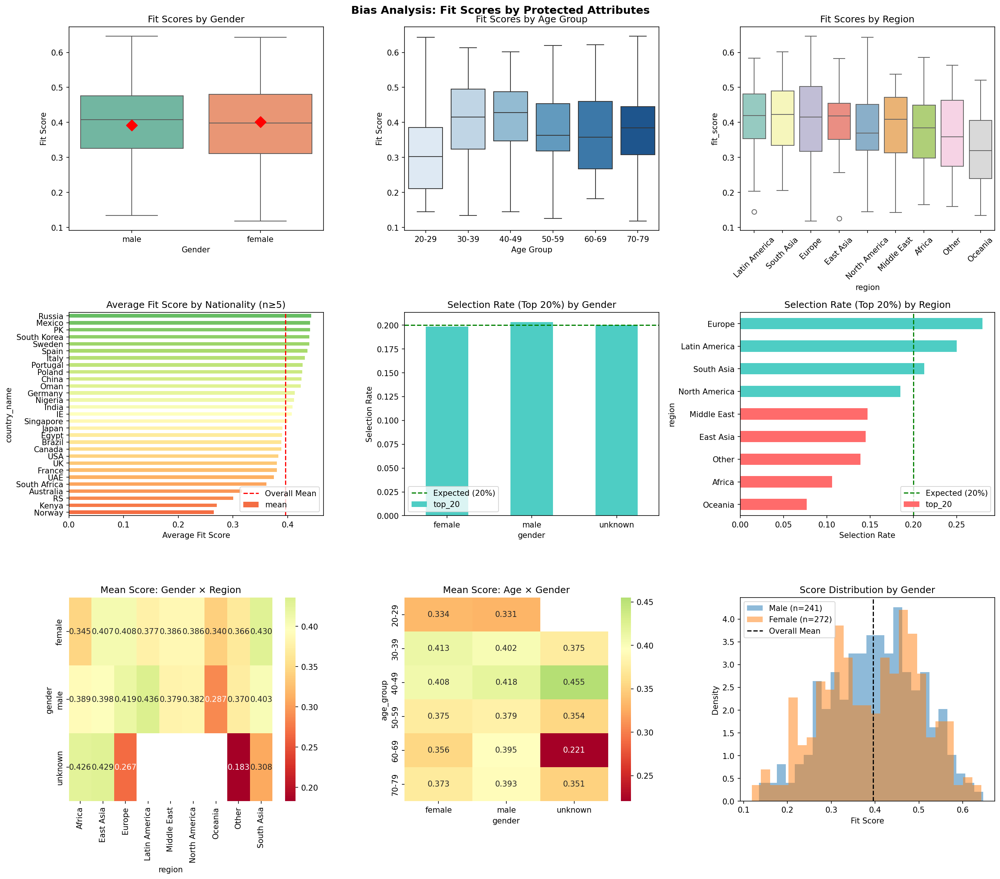

# Responsible AI Resume Ranking & Fairness Analysis

A research-oriented prototype for evaluating bias in AI-assisted resume
ranking systems using sentence embeddings, cosine similarity, and
protected-attribute fairness analysis.

## Project Overview

This project builds a baseline resume-job matching system using
Sentence Transformers and PyTorch, then evaluates whether candidate
fit scores exhibit disparities across protected attributes such as
gender, age, nationality, and region.

### Pipeline

Resume Data
↓
Data Cleaning & Protected Attribute Separation
↓
Sentence Transformer Embeddings
↓
Cosine Similarity Fit Scoring
↓
Candidate Ranking
↓
Fairness & Statistical Analysis
↓
Bias Visualization and Reporting

## Fairness Analysis

The analysis evaluates score distributions and selection rates across:

- Gender
- Age groups
- Nationality
- Geographic region
- Intersectional groups such as Gender × Region

## Key Contributions

- Built a semantic resume-job matching baseline using
  Sentence Transformers and cosine similarity.
- Implemented candidate ranking based on learned text embeddings.
- Separated protected attributes from model inputs to support
  independent fairness evaluation.
- Implemented demographic parity, selection-rate disparity,
  four-fifths rule, and score-parity metrics.
- Performed statistical bias testing using ANOVA,
  Kruskal-Wallis tests, and effect-size analysis.
- Developed intersectional fairness analysis across protected groups.
- Generated automated bias reports and visualizations in Python.

## Tech Stack

**Machine Learning / NLP**
- PyTorch
- Sentence Transformers
- Semantic Embeddings
- Cosine Similarity

**Data & Statistical Analysis**
- Pandas
- NumPy
- SciPy
- ANOVA
- Kruskal-Wallis Testing

**Visualization**
- Matplotlib
- Seaborn

**Responsible AI**
- Demographic Parity
- Four-Fifths Rule
- Score Parity
- Selection Rate Analysis
- Intersectional Analysis
